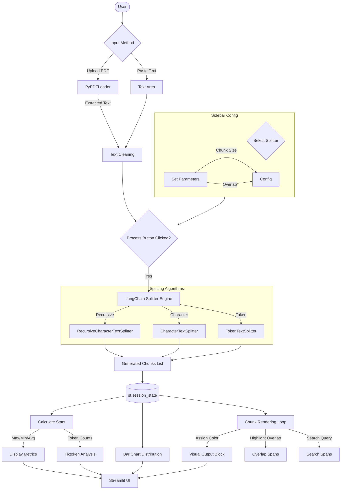

# Application Workflow Diagram

This document illustrates the data flow and logic of the Text Splitter Visualizer application.

## Explanation
1.  **Input:** User provides text via direct input or PDF upload.
2.  **Config:** User selects the splitter type and parameters (size, overlap).
3.  **Processing:** On button click, the app uses LangChain to split the text based on the selected configuration.
4.  **State:** The resulting chunks are stored in `st.session_state` to persist across interactions (like searching).
5.  **Visualization:** The app calculates statistics, generates a distribution graph, and renders each chunk with color-coding and overlap highlighting.
